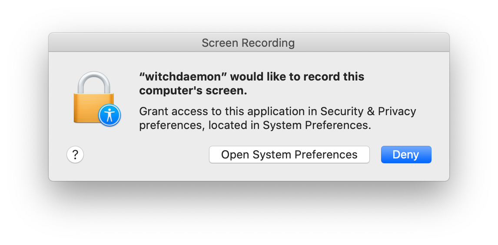

# bonk

Makes a bonk noise when you SIGINT a command 🔨. That's it, that's the whole program.

# Preface

Although this has been developed with security in mind, it is effectively a keylogger. One that does not care about keystrokes other than `CTRL` and `C`, ensures that all are stored as securely as possible in Java's memory and deleted when not used, but a keylogger nonetheless. You shouldn't really use this on any systems storing senstive stuff or where you'll be accessing sensitive stuff.

This project was basically a something that came out of a drunk conversation in the pub with a bunch of developers and hackers and has been made with very little regard for common decent development practices. You have been warned.

That being said, please laugh. It is very funny when it pops off when you least expect it.

# Usage

This project is supported on Windows, MacOS and Linux. To run it, follow these instructions:

1. Install maven and java 11. Hopefully I don't need to explain how to do that :)
2. Download this repo and install the dependencies:
```shell
git clone https://github.com/M-Davies/bonk.git
mvn clean install
```
3. Run the built jar. Easiest way is via maven:
```shell
mvn compile exec:java
```
4. If you're running on Mac or Windows (or on Linux with an EDR or AV installed), you may have to permit the terminal and/or the the jar application permission to read your keystrokes (cause hey ho, it's a keylogger. READ [THE PREFACE](#preface) ABOVE IF YOU HAVE SKIPPED IT).

For example, the permission prompt on MacOS will likely look something like this:

5. If the first attempt to run failed cause of the permission issues, run the program again. When it's listiening for key strokes, you should get this message:
```
Setting up service...
Ready to bonk some boys!
```
6. A bonk noise will play whenever you hit `CTRL+C` (obviously not against the bonk listiener itself though). Happy bonking! 🔨
